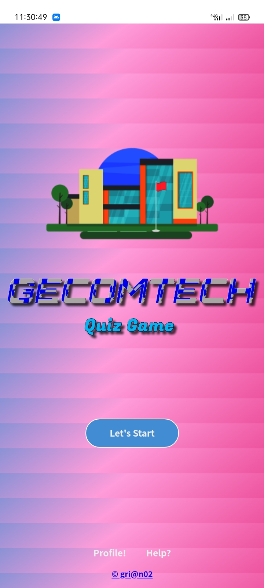
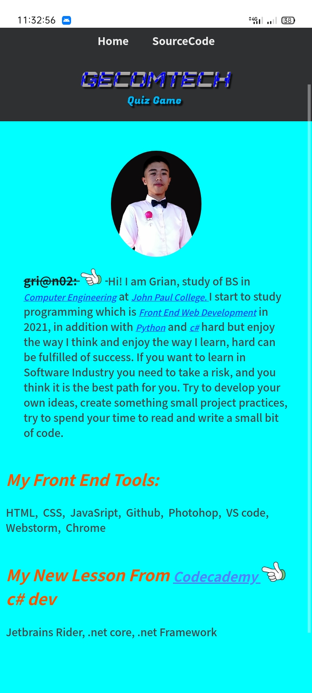
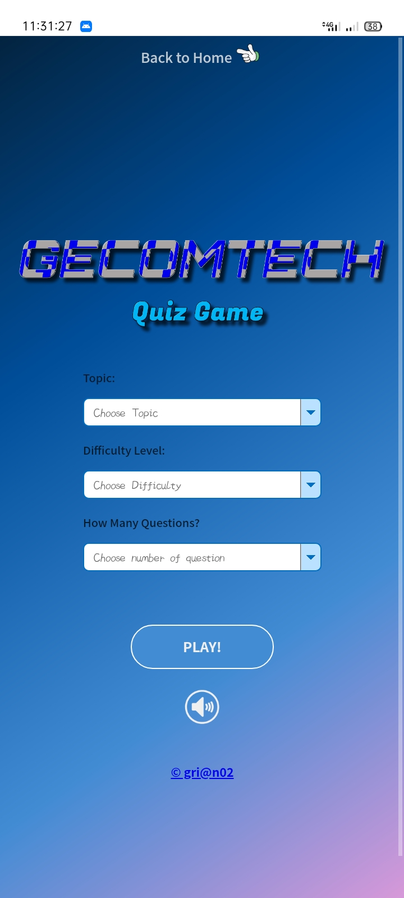
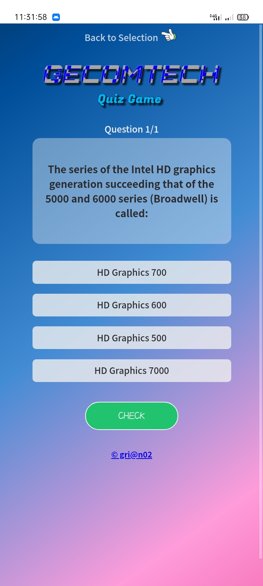
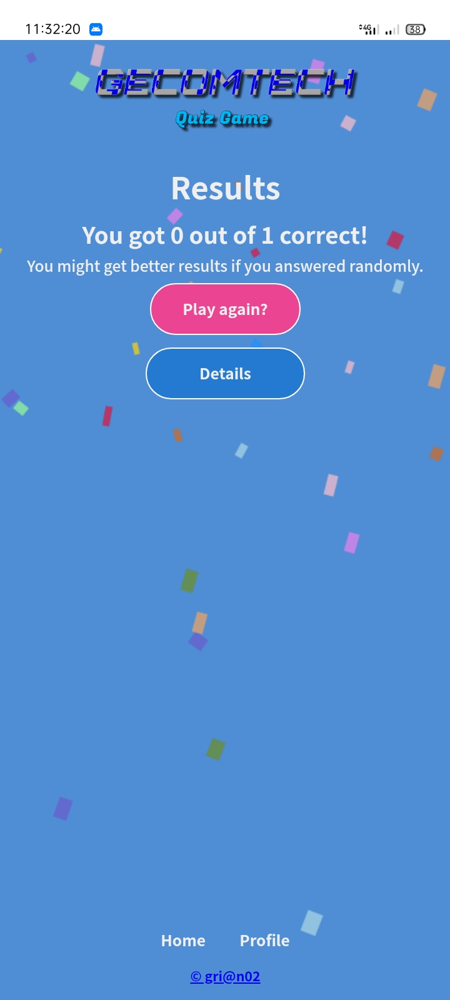
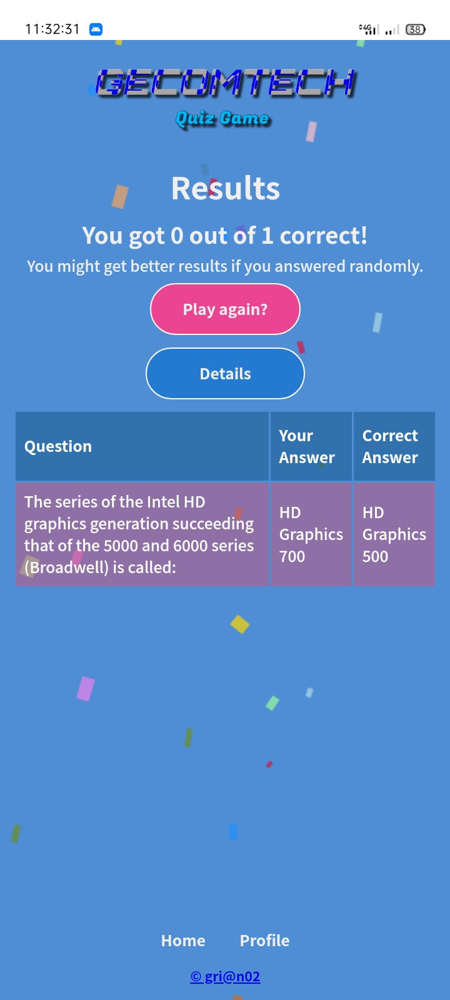

# GECOMTECH Quiz Game

* Educational Related online game with API 
* Related Technology Questions

#
# How to use my quiz game application!
* Click start for the next page of the app, which shows the selection  page

#
* If you want to show my profile click the profile text below the start button in front page of the game

* If you want the code of this app click the SourseCode in upper page and copy/download the whole code

#

* Here is the the selection page which you can choose topic what you want to take
* Here is the Difficulty level of the quiz
* here is the number of question you want to take with the available number of 1 to 15 choices
* Click play to for the game screen

# 
* This show the question of what topic you choose to take
* To take the quiz you need to read first the question before you click the answer below the question
* Once you click the answer kindly click the check button below the answer selection and it will identify your answer if correct/wrong
* If your answer is correct your choosen answer, you hear the crowd clap sound
* And if your answer is wrong  you hear the looser crowd sound
* To proceed the next question kindly click the next button
* If you finished the quiz kind click result button to show the result page
* If you think your choosen topic is not you think and you need to choose the new topic kindly clik the back to selection button in the upper page

#

* This page show the result of the user, which show the number of your points

#

* If you want to take other topic click play again to selection page
* If you want to check youre quiz kindly click the details button ro show wrong answer and what is the correct answer

# 

* If you're using laptop or desktop dont worry these are same.
# Thank you!

